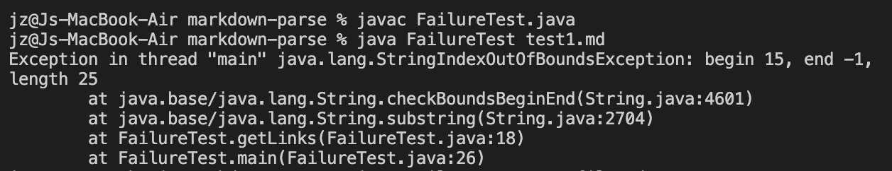
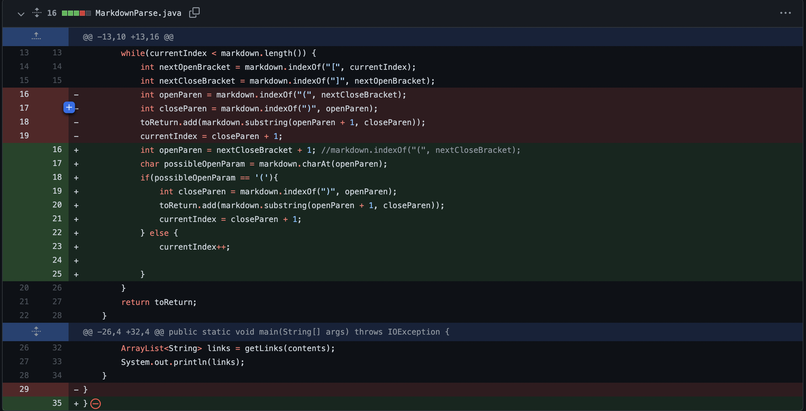
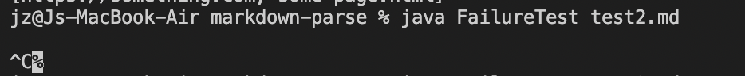
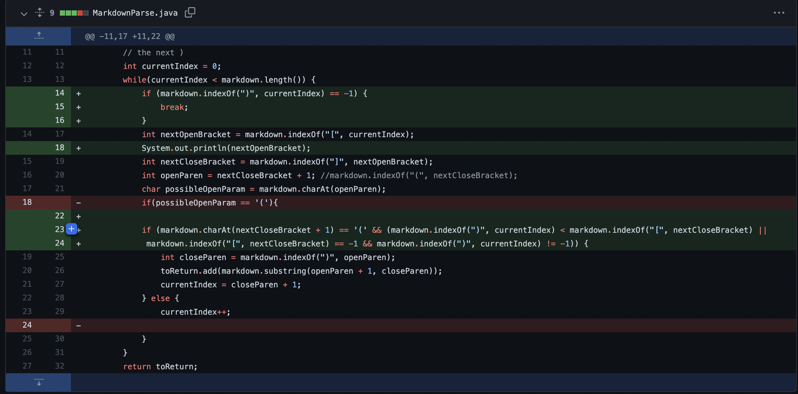
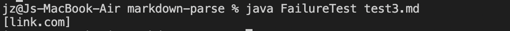
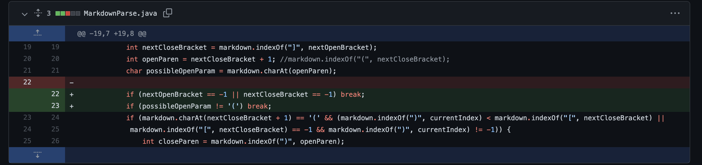

# Week 4 Lab Report

1. Fixing not closing parentheses 

    EX: Here the parentheses are left open, making the link invalid.
    
    EX: [[invalid link](not a url](https://sjin799.github.io/markdown-parse/test1.html)

    Here is the failure output:
    

    This is the change we made:
    

    The bug here is that our code don't know how to handle a non close string for link. The systom we will see is that our code throws exception for out of bound that is caused by the bug. The failure-inducing input helps us confirm that there is a bug of not handling the not closed parentheses and we can use the syptoms to identiy where is the bug located. 

   
2. Fixing for texting in between brackets and parentheses 

    EX: [[Here is a link] and some text (url.com)](https://sjin799.github.io/markdown-parse/test2.html)

    Here is the failure output:
    

    Here is the change we made:
    

    The bug here is that our code don't know how to handle when there is text between brackets and parentheses. The systom we will see is that our code runs into the infinit loops. The failure-inducing input helps us confirm that there is a bug of not handling the text between [] and ()and we can use the infinite loop to rethink about the while loop in our code and rewrite the condition. 

3. Fixing for invalid link format 

   EX: [(link.com)](https://sjin799.github.io/markdown-parse/test3.html)

   Here is the failure output:
   

    Here is the change we made:
    

    The bug here is that our code will treat a text in parentheses as a real link while the text is not in the right format. The systom we will see is that our code perfectly output the text inside of parentheses while it is not a link due to the format of the markdown. The failure-inducing input helps us confirm that there is a bug of not handling the proper format of markdown and we can use the symptom to rethink about setting more if statements to check the format of markdown before exporting the link. 

